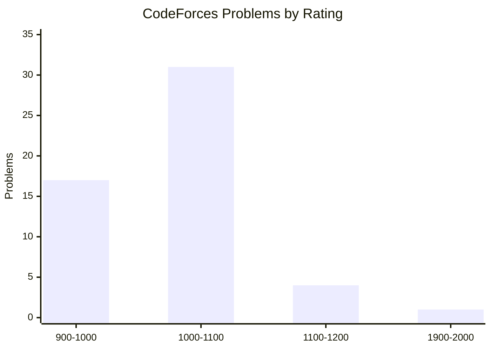

# Competitive Programming

> My personal DSA & Competitive Programming arsenal -- 100+ solutions across CodeForces, CodeChef, and AtCoder, meticulously organized for practice, revision, and interview prep.

<p align="center">
  
  
  
  
  
  
  
</p>

---

## STATS AT A GLANCE

```
Total Problems Solved:  104
Active Since:           Jan 2026
Language:               C++17
Total Commits:          72
Platforms:              3 (CodeForces, CodeChef, AtCoder)
```

### Platform Breakdown

| Platform | Contest Solutions | Rated / Upsolved | Total |
|----------|:----------------:|:-----------------:|:-----:|
| [CodeForces](https://codeforces.com) | 19 | 53 | **72** |
| [CodeChef](https://www.codechef.com) | 18 | -- | **18** |
| [AtCoder](https://atcoder.jp) | 14 | -- | **14** |
| **Total** | **51** | **53** | **104** |

### Difficulty Distribution (CodeForces Rated)



| Rating Range | Problems | Level |
|:------------:|:--------:|:-----:|
| 900 - 1000 | 17 | Beginner |
| 1000 - 1100 | 31 | Easy |
| 1100 - 1200 | 4 | Medium |
| 1900 - 2000 | 1 | Hard |

---

## REPOSITORY STRUCTURE

```
Competitive_Programming/
|
|-- codeforces/                     # 72 solutions
|   |-- contests/                   # Live contest submissions
|   |   |-- round-1077-div2/        # 2 problems (A, B)
|   |   |-- round-1078-div2/        # 2 problems (A, B)
|   |   |-- round-1079-div2/        # 8 problems (A, B, C, + upsolves)
|   |   |-- round-1080-div3/        # 4 problems (A, B, C, D)
|   |   |-- round-1081-div2/        # 3 problems (A, B, C)
|   |
|   |-- rated/                      # Problems by difficulty rating
|       |-- 900-1000/               # 17 problems (Newbie)
|       |-- 1000-1100/              # 31 problems (Pupil)
|       |-- 1100-1200/              # 4 problems (Specialist)
|       |-- 1900-2000/              # 1 problem (Candidate Master)
|
|-- codechef/                       # 18 solutions
|   |-- contests/
|       |-- START223/               # 5 problems
|       |-- START225/               # 5 problems
|       |-- START229/               # 5 problems
|       |-- START244/               # 3 problems
|
|-- atcoder/                        # 14 solutions
|   |-- contests/
|       |-- abc-443/                # 2 problems
|       |-- abc-445/                # 4 problems
|       |-- abc-450/                # 4 problems
|       |-- abc-464/                # 4 problems
|
|-- templates/                      # Reusable code templates
|   |-- solution_template.cpp       # C++17 competitive programming template
|
|-- README.md                       # You are here
|-- .gitignore
```

---

## RECENT CONTESTS PARTICIPATED

| Contest | Platform | Date | Problems Solved |
|---------|----------|:----:|:---------------:|
| CodeForces Round 1081 (Div. 2) | CodeForces | Jul 2026 | 3 / 6 |
| CodeForces Round 1080 (Div. 3) | CodeForces | Jul 2026 | 4 / 7 |
| CodeForces Round 1079 (Div. 2) | CodeForces | Jun 2026 | 8 / 8 |
| AtCoder ABC 464 | AtCoder | Jul 2026 | 4 / 7 |
| AtCoder ABC 450 | AtCoder | May 2026 | 4 / 7 |
| CodeChef START244 | CodeChef | Jul 2026 | 3 / 7 |

---

## TECH STACK

```
Language:     C++17 (GCC)
IDE:          VS Code + CPH Extension (Competitive Programming Helper)
Build:        g++ -std=c++17 file.cpp && ./a.out
Templates:    Custom template with fast I/O, modular arithmetic, and common aliases
```

### Quick Start

```bash
# Clone the repo
git clone https://github.com/thevanshit/Competitive_Programming.git
cd Competitive_Programming

# Run any solution
g++ -std=c++17 codeforces/contests/round-1080-div3/A_Sieve_of_Erato_67_henes.cpp
./a.out
```

---

## NAMING CONVENTION

All solutions follow a consistent pattern for easy search and reference:

```
<ProblemLetter>_<Problem_Title_In_Snake_Case>.cpp
```

**Examples:**
- `A_Divisible_Permutation.cpp` -- CodeForces Round 1077, Problem A
- `B_Center_Alignment.cpp` -- AtCoder ABC 445, Problem B
- `C_Yarik_and_Array.cpp` -- CodeForces Rated 1100-1200

---

## GOALS & PROGRESS

- [x] 100+ problems solved
- [x] 5+ CodeForces contests participated
- [x] 4+ CodeChef Starters attempted
- [x] 4+ AtCoder ABCs attempted
- [ ] 200 problems solved
- [ ] Reach CodeForces Specialist (1400+ rating)
- [ ] Add CSES Problem Set solutions
- [ ] Add LeetCode solutions

---

## KEY SOLUTIONS HIGHLIGHT

| Problem | Platform | Difficulty | Key Concept |
|---------|----------|:----------:|-------------|
| [Near Yet Far](./codeforces/contests/round-1079-div2/Near_Yet_Far.cpp) | CodeForces | Div2 E | Graph Theory / BFS |
| [D_Counting_Factorizations](./codeforces/rated/1900%20-%202000/D_Counting_Factorizations.cpp) | CodeForces | 1900+ | Number Theory / Combinatorics |
| [D_Reconstruct_Chocolate](./atcoder/contests/abc-445/D_Reconstruct_Chocolate.cpp) | AtCoder | ABC D | Greedy / Simulation |
| [Carrot_Collection](./codechef/contests/START244/Carrot_Collection.cpp) | CodeChef | START | Prefix Sum / Optimization |

---

## TOPICS COVERED

```
Arrays & Hashing        Two Pointers        Binary Search
Sliding Window          Prefix Sum          Greedy Algorithms
Recursion               Number Theory       Combinatorics
Graphs & Trees          BFS / DFS           Dynamic Programming
String Manipulation     Bit Manipulation    Sorting & Searching
STL (Containers, Algorithms, Utilities)
```

---

## CONNECT WITH ME

[](https://github.com/thevanshit)
[](https://codeforces.com)

---

<p align="center">
  <i>Building consistency, one problem at a time.</i>
  <br>
  <b>Keep Coding. Keep Growing.</b>
</p>
